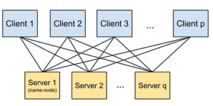

# Overview

Petuum-PS (parameter server) is a distributed key-value store that enables an
easy-to-use, distributed-shared-memory model for writing distributed machine
learning (ML) programs over BIG DATA. In many ML algorithms (e.g. stochastic
gradient descent and collapsed Gibbs sampling), client workers compute updates
(e.g., gradients and new samples) based on a data partition and shared model
parameters. Petuum-PS enables such computation at scale by storing the shared
model parameters on the distributed server nodes and partition the data on the
client nodes. The following diagram demonstrates the Petuum-PS topology, where
Servers and clients interact via a bipartite topology, while a name-node
machine handles bookkeeping and assignment of keys to servers.



Additionally, Petuum-PS supports novel consistency models such as bounded
staleness, which achieve provably good results on iterative-convergent ML
algorithms. Petuum-PS additionally offers several "tuning knobs" available
to experts but otherwise hidden from regular users such as thread and
process-level caching and read-my-write consistency. In the future we will
also support out-of-core data streaming for datasets that are too large to fit
in machine memory.

Petuum-PS is part of the Petuum project. For more information on Petuum, visit
http://petuum.org/

# Installation

Currently Petuum has only been tested on Ubuntu 12.04 LTS. To install, use

``` sh
# Under project root directory 'petuum'
make
```

This will take a while as it downloads and builds many third party tools.

## Helloworld

We first need to set up the machine configuration. Machine configuration
always have 3 columns denoting server ID, machine IP, and port number. For
example,

``` sh
cat machinefiles/localserver
# 0 127.0.0.1 9976
# 1 127.0.0.1 9977
```

This config will create 2 server processes on localhost (127.0.0.1) with
server ID 0 and 1 on port `9976` and `9977` respectively. Server ID's need to
be unique, and there should be server 0 which is the namenode server. Note
that only 1 client process is created for each unique IP. For example, only 1
client process will be created for this example config.

Moving on,

``` sh
# Under project root directory 'petuum'
make helloworld

# Start the server. Helloworld uses float tables and thus float servers.
sh scripts/run_float_servers.sh machinefiles/localserver

# Wait till seeting 'Servers are ready to accept clients!'

# See what arguments are needed...
sh scripts/run_helloworld.sh

# ... then run helloworld with 3 client threads.
sh scripts/run_helloworld.sh machinefiles/localserver 3
```

If you get "pthread_join returned" then you are done! Currently we use a
script to shutdown the server:

``` sh
sh scripts/tear_down.sh machinefiles/localserver
```

## Topic Model (LDA)

Now let's try something fancier. Topic model automatically find the topics,
defined as weighted set of vocabularies, and the topics of each document from
a set of documents.

``` sh
# Under project root directory 'petuum'
make lda

# Compile data processors
make tools

# Process the toy dataset 20news to /tmp/20news.* with 1 partition 
# (single machine)
sh scripts/run_lda_data_processor.sh datasets/lda_data/20news.dat /tmp/20news 1

# Start the server
sh scripts/run_int_servers.sh machinefiles/localserver

# Run with 3 client threads.
sh scripts/run_lda.sh machinefiles/localserver /tmp/20news 3
```

This runs the LDA Gibbs sampler for 10 iterations for 100 topics, printing out
the likelihood at each iteration. You can set the number of topics in the
script with `num_topics`. The default is 100 topics. Again, remember to use the
`scripts/tear_down.sh` to shutdown the server.
